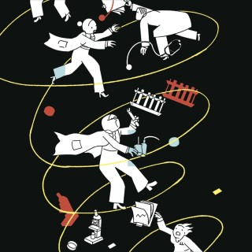
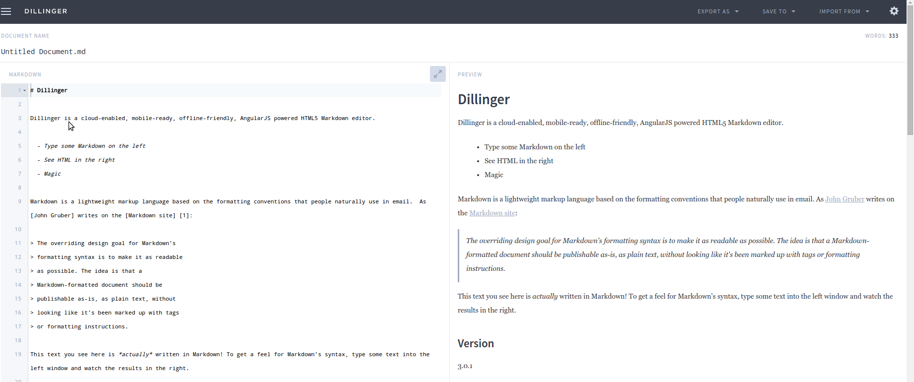
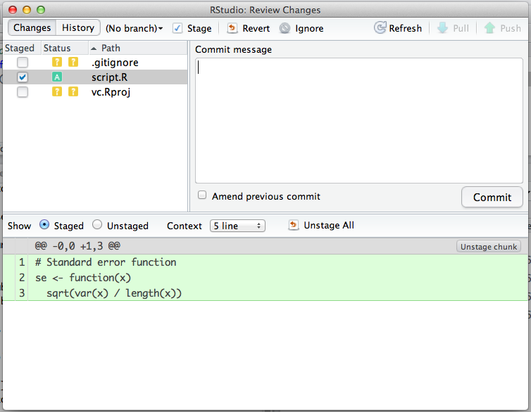
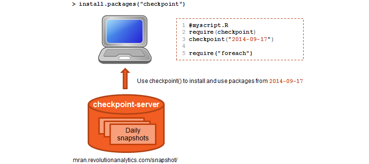

<!--
      .....~IIIIIIIIII777$$7... ... ..  
      .~II???III?????????III77$$...     
    .I???$$I=~+?7$ZZOOOOZZZ$$7I7$$:. .  
  .??~$$?:~=7ODD=.. .... ....~OZ$7$Z..  
 .??Z$?,~~88?..+????????????+=...=77ZZ..
,?,ZI=,~ZD:....IZDDDDDDDDDDD  DO+7$...7$~.
??Z$:.~ON......IZ??+,=====+=??+?IO...78.
?=$I.,$D..... .IZ???$M???+7O+7???77. .77
??$?.:ZD..  ...IZ???$N......?$??+78 ..?$
IIZ7,:$8..  ...IZ???$N.....~:D?+~Z=...7.
~77$+,=$$......IZ???7++++=:~O?=:OM...=I.
.:777I:+$O  ...IZ??+???????:ZODM....?M. 
..,777I?=?$O...IZ???I8OO7?+I7$.. .?I~.  
 ...+Z$7I?+?777?Z???ZN...$?I$8?ZIZ$...  
.   ...$Z$77I??IZ???$N777I7+???7O... .  
..   .....=OOZZIZ??+$M$ZOOO$Z++?IO....  
          .  ..IZ???$N.....,I$++?7O...  
         . ....I7===$N.. ...77+===IO..  
            ...+IIIII7. ..  .=+?++???.  
                         GlassGiant.com
-->

<style>
strong {
  font-weight: bold;
}
</style>

## Outline
1. The reproducibility crisis.
2. The elements of reproducible research.
3. Markdown and RMarkdown
4. Generating reproducible documents with RStudio
5. Dependency management.


---

## The Reproducibility crisis

Over the past few years, there has been a growing awareness that many experimentally established "facts" don't seem to hold up to repeated investigation.

This was highlighted in a 2010 article in the [New Yorker](http://www.newyorker.com/magazine/2010/12/13/the-truth-wears-off) in which it is claimed that we are facing with a [reproducibility crisis](http://theconversation.com/science-is-in-a-reproducibility-crisis-how-do-we-resolve-it-16998).

# "Before the effectiveness of a drug can be confirmed, it must be tested and tested again. Different scientists in different labs need to repeat the protocols and publish their results. The test of replicability, as it's known, is the foundation of modern research. Replicability is how the community enforces itself. It's a safeguard for the creep of subjectivity."

<div align="right">
  Jonah Lehrer [New yorker]
</div>




---

## The repliction v.s reproduction

We will focus on **Reproducible Computational Research**.

# "Reproducible Research: Make analytic data and code available so that others may reproduce findings."

<div align="right">
  Roger Peng
</div>


---


## Ten Simple Rules for Reproducible Computational Research

1. For Every Result, Keep Track of How It Was Produced.
2. Avoid Manual Data Manipulation Steps.
3. Archive the Exact Versions of All External Programs Used.
4. Version Control All Custom Scripts.
5. Record All Intermediate Results, When Possible in Standardized Formats.
6. For Analyses That Include Randomness, Note Underlying Random Seeds.
7. Always Store Raw Data behind Plots.
8. Generate Hierarchical Analysis Output, Allowing Layers of Increasing Detail to Be Inspected.
9. Connect Textual Statements to Underlying Results.
10. Provide Public Access to Scripts, Runs, and Results.

From [PLOS](http://www.ploscompbiol.org/article/info%3Adoi%2F10.1371%2Fjournal.pcbi.1003285)

---

## Where to start

Start with this article by [FitzJohn et al.](http://ropensci.org/blog/2014/06/09/reproducibility/).


- Course on [Coursera](https://www.coursera.org/course/repdata).
- Video from [Roger Peng](http://youtu.be/aH8dpcirW1U).


---

## Book

A book about reproducible research


---


## Reproducible research in academic research

You can download this paper along with the [data](http://datadryad.org/resource/doi:10.5061/dryad.g7jq6) (the compilation of the Latex document includes the execution of all the statistical analysis).


---

## Reproducible research in academic research

- Apart from [Dryad](http://datadryad.org), you can store you reserach data in [figshare](http://figshare.com/about).
- [figshare](http://figshare.com/about) is a repository where users can make all of their research outputs available in a citable, shareable and discoverable manner.


---

## Number of internet users (World Bank)

- Internet users (per 100 people). Internet users are "people with access to the worldwide network".
- The data is extracted from the World Bank using the library `WDI` and averaged over time (2005-2011). 

```{r, message=FALSE}
library(dplyr)
library(magrittr)
library(WDI)
library(googleVis)
op <- options(gvis.plot.tag='chart')
```


---


## Number of internet users (World Bank)


```{r}
avg.internet.users<- WDI(indicator="IT.NET.USER.P2") %>% 
                    group_by(iso2c) %>% 
                    summarise(mean.num.users=round(mean(IT.NET.USER.P2),digit=1))

WDI(indicator="IT.NET.USER.P2") %>% filter(iso2c=="IL")

```


---

## Number of internet users (World Bank)


```{r}
avg.internet.users %>% filter(iso2c=="IL")
```


---

## Number of internet users (World Bank)


```{r, result="asis", tidy=FALSE}
FCMap <- gvisGeoMap(data = avg.internet.users,
                    locationvar = "iso2c",
                    numvar = "mean.num.users",
                    options = list(
                      colors = "[0xECE7F2, 0xA6BDDB, 0x2B8CBE]",
                      width = "780px",
                      height = "500px"))
```


---

## Number of internet users (World Bank)


```{r, results="asis", tidy=FALSE}

plot(FCMap)

```


---

## Reproducible computing

This document was generated together with the statistical analysis and the graphics generation.

# Q: Is its reproducible?

<!-- 
A: 
  not next year when the database is changed and the average is done over more years.
  not shure anout the behavior of R and all the other libraries.
-->

- Store the source files and the textual analysis together in a version control system.
- Store the raw data (cvs) or as objects (serialization) in a version control system .
- Save the software environment details.

--- 
  
## Markdown 

Markdown enables writing in an **easy-to-read**, **easy-to-write** plain text format, and convert it to HTML.

# "The overriding design goal for Markdown's formatting syntax is to make it as **readable** as possible. The idea is that a Markdown-formatted document should be **publishable as-is, as plain text**, without looking like it's been marked up with tags formatting instructions."

<div align="right">
  John Gruber
</div>


--- 
  
## Markdown 

Learning [markdown](https://github.com/adam-p/markdown-here/wiki/Markdown-Here-Cheatsheet) is easy using [Dillinger](http://dillinger.io/). 



---

## knitr (Yihui Xie)

- [knitr](http://yihui.name/knitr/) implement the analysis in a **literate programming** style.
- Replaces `SWeave`.
- Document includes **Code chunks**.


---


## R Markdown (by RStudio)

# [R Markdown](http://rmarkdown.rstudio.com/) is a variant of Markdown that has embedded R **code chunks**, to be used with **knitr** to make it easy to create reproducible web-based reports.

With R Markdown you can:
- Compile HTML, PDF, or MS Word notebooks from R scripts.
- Create Beamer, ioslides and [Slidy](http://www.w3.org/Talks/Tools/Slidy2/#(1) presentations.
- Create interactive R Markdown documents using Shiny.
  - My Shiny [workshop](https://drive.google.com/viewerng/viewer?a=v&pid=sites&srcid=ZGVmYXVsdGRvbWFpbnxzaGxvbWlsaWZzaGl0c3xneDoyNjIyNzllYTAzYmY2OWYx) and [code](https://github.com/shlomyli/shiny).
- RStudio has also a [presentation viewer](https://support.rstudio.com/hc/en-us/articles/200486468-Authoring-R-Presentations).

--- 

## R Markdown

- View this [video](https://www.youtube.com/watch?v=2yvW0O_7xOg#t=41).
- Another [link](https://support.rstudio.com/hc/en-us/articles/200552086-Using-R-Markdown)


---

## Why use HTML and not Pdf

- It is tetxual.
- **Infographics** 
  - browsers supports SVG and enable interactions
  -[googleVis](http://cran.r-project.org/web/packages/googleVis/vignettes/Using_googleVis_with_knitr.html) 
  - The [d3](http://d3js.org/) javascript library. See nice [example](http://glimmer.rstudio.com/timelyportfolio/shiny-d3-showreel/).
- Browser supports math (MathJax).
- Hosting of web pages on Github.

---

## Tables

```
| val           | str   |
| ------------- | ----- |
| 1             | a     |
| 2             | b     |
```

| val           | str   |
| ------------- | ----- |
| 1             | a     |
| 2             | b     |


---

## Tables

```{r, results="asis"}
library(xtable)
df<-data.frame(x=c(1,2),y=c("a","b"))
tbl<-xtable(df)
print(tbl,type="html")
```

---


## RStudio Git integration

[here](http://nicercode.github.io/git/rstudio.html)




---


## RStudio Packrat integration

[Packrat](http://rstudio.github.io/packrat) is a dependency management system for R.
Creates a private package library for a given R project (i.e. working directory).

See [here](http://www.r-bloggers.com/creating-reproducible-software-environments-with-packrat/) 
and [here](http://rstudio-pubs-static.s3.amazonaws.com/21739_5ef7fdf9080346db8a7bafefabca5788.html#2).


When you start an R session in a packrat project directory, R will only look for packages in your private library; and anytime you install or remove a package, those changes will be made to your private library.

---


## The Packrat dependency management library

- **Isolated**: Installing a new or updated package for one project won't break your other projects, and vice versa. That's because packrat gives each project its own private package library.
- **Portable**: Easily transport your projects from one computer to another, even across different platforms. Packrat makes it easy to install the packages your project depends on.
- **Reproducible**: Packrat records the exact package versions you depend on, and ensures those exact versions are the ones that get installed wherever you go.

---

## Checkpoint (Revolution R)

Revolution stores daily snapshots of all CRAN packages. You can access these daily snapshots using the checkpoint package, which installs and consistently use these packages just as they existed at the snapshot date. 



---

## Docker

- People have been successfull in using [Docker](http://melissagymrek.com/science/2014/08/29/docker-reproducible-research.html) and R.
- Docker has a **repository of images** called Docker hub that is pretty analagous to github except it's for Docker images instead of for code. You can pull, push, track, and modify images and share them with other people.

[paper]( http://arxiv.org/abs/1410.0846)

---

## RNG seed

- Random number generators generate pseudo-random numbers based on an initial seed.
- Setting the seed allows for the stream of random numbers to be exactly reproducible.
- In R you can use the `set.seed()` function to set the seed and to specify the random number generator to use.

```{r}
set.seed(42)
rnorm(5)
```

---

## RNG seed

```{r}
rnorm(5)
set.seed(42)
rnorm(5)
```

---

## Software Environment
```{r}
sessionInfo()
```

